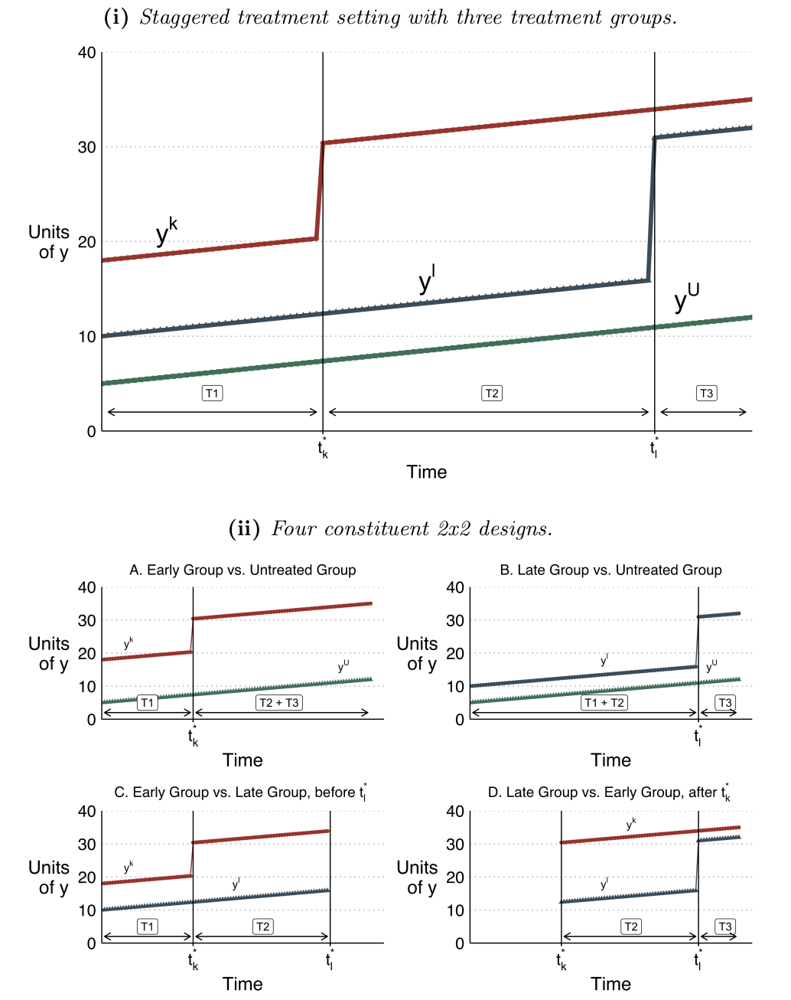
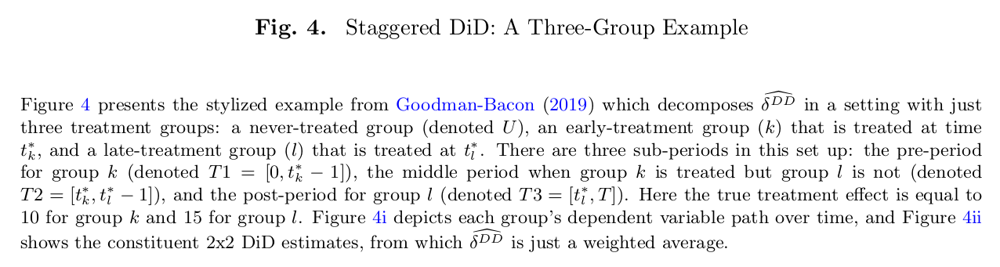

```{r Setup, include = F}
options(htmltools.dir.version = FALSE)
library(pacman)
p_load(tidyverse,patchwork,kableExtra,fixest,lmtest,xtable,
       did,magrittr,ggthemes,bacondecomp,multcomp,fastDummies,
       ggforce, hrbrthemes, tictoc)
# Define pink color
red_pink <- "#e64173"
carolina_blue <- "#99badd"
turquoise <- "#20B2AA"
azure <- "#007fff"
columbia_blue <- "#9bddff"
blue_grey <- "#6699cc"
cool_grey <- "#8c92ac"
cool_black <- "#002e63"
orange <- "#FFA500"
red <- "#fb6107"
blue <- "#3b3b9a"
green <- "#38c57f"
grey_light <- "grey70"
grey_mid <- "grey50"
grey_dark <- "grey20"
purple <- "#6A5ACD"
slate <- "#314f4f"
rmd_green <- "#73d7ad"
rmd_pink <- "#d7739d"
uo_green <- "#007A33"
grant_red <- "#AA0000"
coral_red <- "#ff4040"
```

# {.tabset .tabset-fade .tabset-pills}

## Overview

The decentralized, federalist system of governing of the US provides excellent variation for policy analysis. Countless papers have leveraged this variation in the adoption of specific policies as a natural experiments. The minimum wage, legalization of marijuana, .... are just a few examples of the types of policy "treatments" that have changed on a state level that economists and other social scientists have researched. The difference-in-differences estimator has become the workhorse methodology to identify the casual effects of these policies.

The simplest DiD design is the 2x2 DiD which involves two discrete time periods - pre and post - and two treatment groups - treatment and control. The effect of treatment on the outcome variable can be estimated by comparing the change in the average outcome in the treated units to the controls units. However, the parallel trends assumption is fundamental to this inference in order to manage the fundamental problem of casual inference. However, this framework can be generalized to more than 2 time periods and more than two treatment groups when treatment is staggered. Staggered meaning that treatment occurs at multiple different times periods, treating units at different times. Moreso staggered DiD designs have desirable properties over the traditional 2x2 DiD. Staggered DiD has treatments that are more robust to plausible alternative concerns that contemporaneous trends may be driving results.

The typical 2x2 DiD model looks something like

\begin{equation*}
y_{it} = \beta_0 + \beta_1 TREAT_i + \beta_2 POST_t + \beta_3(TREAT_i \cdot POST_t) + \varepsilon_{it}
\end{equation*}

Which can be generalized to settings with more than two units and two time periods in a two way fixed effects model (TWFE).

\begin{equation*}
y_{it} = \theta_i + \lambda_t + \beta^{DD}D_{it} + \varepsilon_{it}
\end{equation*}

Where we can interpret $D_{it} = TREAT_i * POST_t$


However advances in econometric theory (Goodman-Bacon 2019) suggests that staggered DiD designs may not provide valid estimates of the casual relationships - even when treatment is randomly assigned. The intuition is that in the staggered DiD approach, already treated units can act as controls, and changes over time are subtracted from changes of later treated units.

The staggered DiD TWFE estimate approach is a "weighted average of all possible two-group/two-period DiD estimates in the data". The treatment effect estimates are skewed by comparisons between units that treated earlier to units that are treated later when the treatment effect is heterogeneous across treatment groups.






To show this I am going to present N simulations that all have varying DGPs. The will all have the following structure:

- State by year balanced panels - 50 states over 26 years (1995 - 2020)

- Time invariant unit effects that are drawn independently from $N(0,0.5^2)$

- Time varying year effect that are drawn independently from $N(0,0.5^2)$

Simulations 01, 02 and 03 will show unbiased estimates of the treatment effect while simulations 04 and 05 will show biased estimates. The main point is that when we have a staggered DiD design with treatment effect heterogeneity, we can run into serious problems using the traditional TWFE estimator.

The following figure explains the issue very well. It is adapted from Goodman-Bacon (2019) but this figure is directly pulled from (Baker et. al. 2021) as is much of the simulations.


```{r, echo = F}
dosims <- function(i, fun) {
  # make data from function
  dt <- fun()
  # estimate model
  feols(y ~ treat | unit + year , cluster = ~state, data = dt) %>% 
    broom::tidy(conf.int = TRUE) %>% 
    dplyr::select(estimate) %>% 
    mutate(sim = i)
}
```


## Simulation 01

Simulation 01 assumes that half the states are treated in 2005 while the other half remain untreated and act as the control. It effectively is the standard 2x2 DiD with only two time periods and two units.

The outcome variable is the sum of the time invariant and time varying effects, treatment, and an error. Treatment is a level shift and is drawn from $N(2,0.2^2)$

```{r, sim01_function}
sim01 = function(...) {
  ## generate unit specific variation
  unit <- tibble(
    unit = 1:1000,
    unit_fe = rnorm(1000, 0, 0.5),
    state = sample(rep(1:50, 20), 1000, replace = FALSE),
    group = ifelse(state %in% 1:25, 1, 2),
    treated = ifelse(group == 2, 1, 0),
    # average yearly treatment effect (by group) [\beta = 2]
    beta_hat = ifelse(group == 2, 2, 0),
    ) %>%
    rowwise() %>% 
  mutate(beta = ifelse(group == 2, rnorm(1, beta_hat, 0.2), 0)) %>% 
  ungroup()

  ## generate year specific variation
  year <- tibble(
    year = 1995:2020,
    year_fe = rnorm(26, 0, 0.5)
  )

  ## Put them together
  dat_iter = crossing(unit, year) %>% 
    mutate(e = rnorm(nrow(.), 0, 0.5),
           treat = ifelse(treated == 1 & year >= 2005, 1, 0),
           tau = ifelse(treat == 1, beta, 0),
           y = unit_fe + year_fe + tau + e)
  
  return(dat_iter)
}

```

```{r, warning = F, message=F, fig.width = 10}
#### sim one

data01 = sim01()

  ## plot

  g10 = ggplot(data = data01, aes(x = year, y = y, group = unit)) + 
    geom_line(alpha = 0.1, size = 0.25, color = grey_mid) +
    theme_ipsum() +
    labs(title = "Simulation 01",
         subtitle = expression(paste("Single treatment period + homogenous treatment effect (", tau, " = 2)")),
         caption = "Treatment turns on in 2005",
         x = "Year",
         y = "Y",
         color = "Treatment") +
    geom_line(data = data01 %>% 
                group_by(treated, year) %>% 
                summarise(mean_y = mean(y)),
              aes(x = year, y = mean_y, group = factor(treated), color = factor(treated)),
              size = 1.25) +
    geom_vline(xintercept = 2004.5, linetype = "dashed", size = 0.25) +
    scale_color_manual(values = c(grey_dark, azure)) +
    scale_y_continuous(breaks = seq(-4,8,2))
    
  g10
```

```{r, cache = T}
#### sim 500
tic()
simdata01 <- map_dfr(1:500, .f = dosims, fun = sim01)
toc()
```

```{r, warning = F, message=F, fig.width = 10}

  g11 = ggplot(data = simdata01, aes(x = estimate)) +
    geom_density(fill = carolina_blue, alpha = 0.2) +
    geom_vline(xintercept = 2, linetype = "dashed", size = 0.25) +
    theme_ipsum() +
    labs(title = "Simulation 01",
         subtitle = expression(paste("Single treatment period + homogenous treatment effect (", tau, " = 2)")),
         caption = "Treatment turns on in 2005",
         x = "Estimate",
         color = "Treatment") +
    scale_x_continuous(breaks = seq(1.95,2.05,0.05), limits = c(1.95,2.05))
  
  g11
```


## Simulation 02

Simulation 02 allows for staggered timing of treatments where states are randomly assigned into three groups. Each group is treated at one of the following times: 2000, 2008, 2016. There are no units never treated.

The outcome variable is the sum of the time invariant and time varying effects, treatment, and an error. Treatment is a level shift and is drawn from $N(2,0.2^2)$ for each unit.

```{r}
sim02 = function(...) {
  ## generate unit specific variation
  unit <- tibble(
    unit = 1:1000,
    unit_fe = rnorm(1000, 0, 0.5),
    state = sample(rep(1:50, 20), 1000, replace = FALSE),
    group = case_when(
      state %in% 1:17 ~ 2000,
      state %in% 18:35 ~ 2008,
      state %in% 35:50 ~ 2016
    ),
    beta_hat = case_when(
      group == 2000 ~ 2,
      group == 2008 ~ 2,
      group == 2016 ~ 2
    )) %>%
    rowwise() %>% 
    mutate(beta = rnorm(1, beta_hat, 0.2), 0) %>% 
    ungroup()
  
  ## generate year specific variation
  year <- tibble(
    year = 1995:2020,
    year_fe = rnorm(26, 0, 0.5)
  )
  
  ## Put them together
  dat_iter = crossing(unit, year) %>% 
    mutate(e = rnorm(nrow(.), 0, 0.6),
           treat = ifelse(year >= group, 1, 0),
           tau = ifelse(treat == 1, beta, 0),
           y = unit_fe + year_fe + tau + e)
  
  return(dat_iter)
}
```


```{r, warning = F, message = F, fig.width = 10}
#### sim one

data02 = sim02()

  ## plot

  g20 = ggplot(data = data02, aes(x = year, y = y, group = unit)) + 
    geom_line(alpha = 0.1, size = 0.25, color = grey_mid) +
    theme_ipsum() +
    labs(title = "Simulation 02",
         subtitle = expression(paste("Staggered treatment periods + homogenous treatment effect (", tau, " = 2)")),
         caption = "Treatment is staggered between 2000, 2008, 2016. All units are treated after 2016.",
         x = "Year",
         y = "Y",
         color = "Treatment") +
    geom_line(data = data02 %>% 
                group_by(group, year) %>% 
                summarise(mean_y = mean(y)),
              aes(x = year, y = mean_y, group = factor(group), color = factor(group)),
              size = 1.25) +
    geom_vline(xintercept = c(1999.5, 2007.5, 2015.5), linetype = "dashed", size = 0.25) +
    scale_color_manual(values = c(cool_black, azure, blue_grey)) +
    scale_y_continuous(breaks = seq(-4,8,2))
  
  g20
```

```{r, cache = T}
#### sim 500
tic()
simdata02 <- map_dfr(1:500, .f = dosims, fun = sim02)
toc()

```

```{r, warning = F, message=F, fig.width = 10}
  
  g21 = ggplot(data = simdata02, aes(x = estimate)) +
    geom_density(fill = carolina_blue, alpha = 0.2) +
    geom_vline(xintercept = 2, linetype = "dashed", size = 0.25) +
    theme_ipsum() +
    labs(title = "Simulation 02",
         subtitle = expression(paste("Staggered treatment periods + homogenous treatment effect (", tau, " = 2)")),
         caption = "Treatment is staggered between 2000, 2008, 2016. All units are treated after 2016.",
         x = "Estimate",
         color = "Treatment") +
    scale_x_continuous(breaks = seq(1.95,2.05,0.05), limits = c(1.95,2.05))
  
  g21
```

## Simulation 03

Simulation 03 assumes that half the states are treated in 2005 while the other half remain untreated and act as the control. However, it differs from simulation 01 in that the treatment effect is dynamic in that it increases over time. In each period the treatment effect grows by 0.3 so the cumulative treatment effect will be 2.55

The outcome variable is the sum of the time invariant and time varying effects, treatment, and an error.


```{r}
sim03 = function(...) {
  ## generate unit specific variation
  unit <- tibble(
    unit = 1:1000,
    unit_fe = rnorm(1000, 0, 0.5),
    state = sample(rep(1:50, 20), 1000, replace = FALSE),
    group = ifelse(state %in% 1:25, 0, 1),
    treated = ifelse(group == 1, 1, 0),
    # average yearly treatment effect (by group) [\beta = 2]
    beta_hat = ifelse(group == 1, 0.3, 0),
  ) %>%
    rowwise() %>% 
    mutate(beta = rnorm(1, beta_hat, 0.2), 0) %>% 
    ungroup()
  
  ## generate year specific variation
  year <- tibble(
    year = 1995:2020,
    year_fe = rnorm(26, 0, 1)
  )
  
  ## slap them together
  dat_iter = crossing(unit, year) %>% 
    mutate(e = rnorm(nrow(.), 0, 0.5),
           treat = ifelse(treated == 1 & year >= 2005, 1, 0),
           tau = ifelse(treat == 1, beta, 0)) %>% 
    ## Generate time varying dependent variable
    group_by(unit) %>% 
    mutate(cumtau = cumsum(tau)) %>% 
    mutate(y = unit_fe + year_fe + cumtau + e)
  
  return(dat_iter)
}
```


```{r, warning = F, message=F, fig.width = 10}
#### sim one

data03 = sim03()

  ## plot

  g30 = ggplot(data = data03, aes(x = year, y = y, group = unit)) + 
    geom_line(alpha = 0.1, size = 0.25, color = grey_mid) +
    theme_ipsum() +
    labs(title = "Simulation 03",
         subtitle = expression(paste("Staggered treatment periods + constant treatment effect that change over time (", tau, " = 5, 3, 1)")),
         caption = "Treatment is staggered between 2000, 2008, 2016. All units are treated after 2016.",
         x = "Year",
         y = "Y",
         color = "Treatment") +
    geom_line(data = data03 %>% 
                group_by(group, year) %>% 
                summarise(mean_y = mean(y)),
              aes(x = year, y = mean_y, group = factor(group), color = factor(group)),
              size = 1.25) +
    geom_vline(xintercept = c(2005), linetype = "dashed", size = 0.25) +
    scale_color_manual(values = c(grey_dark, azure)) +
    scale_y_continuous(breaks = seq(-20,30,10))
  
  g30
```

```{r, cache = T}
#### sim 500
tic()
simdata03 <- map_dfr(1:600, .f = dosims, fun = sim03)
toc()
```

```{r, warning = F, message=F, fig.width = 10}
te = mean(cumsum(rep(0.3, length(2005:2020))))


  g31 = ggplot(data = simdata03, aes(x = estimate)) +
    geom_density(fill = carolina_blue, alpha = 0.2) +
    geom_vline(xintercept = te, linetype = "dashed", size = 0.25) +
    theme_ipsum() +
    labs(title = "Simulation 03",
         subtitle = expression(paste("Staggered treatment periods + time varying treatment effect (", tau, " = 2.55)")),
         caption = "Treatment occurs in 2005",
         x = "Estimate",
         color = "Treatment")
    # scale_x_continuous(breaks = seq(1.95,2.05,0.05), limits = c(1.95,2.05))
  
  g31
```


## Simulation 04

Simulation 04 allows for staggered timing of treatments where states are randomly assigned into three groups. Each group is treated at one of the following times: 2000, 2008, 2016. There are no units never treated.

The outcome variable is the sum of the time invariant and time varying effects, treatment, and an error. Treatment is a level shift and it varies by time period. $\beta_1^{2000} = 5$, $\beta_1^{2008} = 3$, and $\beta_1^{2016} = 1$ and treatment is drawn from $N(2,0.2^2)$ for each unit.

```{r}
sim04 = function(...) {
  ## generate unit specific variation
  unit <- tibble(
    unit = 1:1000,
    unit_fe = rnorm(1000, 0, 1),
    state = sample(rep(1:50, 20), 1000, replace = FALSE),
    group = case_when(
      state %in% 1:17 ~ 2000,
      state %in% 18:35 ~ 2008,
      state %in% 35:50 ~ 2016
    ),
    beta_hat = case_when(
      group == 2000 ~ 5,
      group == 2008 ~ 3,
      group == 2016 ~ 1
    )) %>%
    rowwise() %>% 
    mutate(beta = rnorm(1, beta_hat, 0.5), 0) %>% 
    ungroup()
  
  ## generate year specific variation
  year <- tibble(
    year = 1995:2020,
    year_fe = rnorm(26, 0, 1)
  )
  
  ## Put them together
  dat_iter = crossing(unit, year) %>% 
    mutate(e = rnorm(nrow(.), 0, 1),
           treat = ifelse(year >= group, 1, 0),
           tau = ifelse(treat == 1, beta, 0),
           y = unit_fe + year_fe + tau + e)
  
  return(dat_iter)
}
```

```{r, warning = F, message=F, fig.width = 10}
#### sim one

data04 = sim04()

  ## plot

  g40 = ggplot(data = data04, aes(x = year, y = y, group = unit)) + 
    geom_line(alpha = 0.1, size = 0.25, color = grey_mid) +
    theme_ipsum() +
    labs(title = "Simulation 04",
         subtitle = expression(paste("Staggered treatment periods + constant treatment effect that change over time (", tau, " = 5, 3, 1)")),
         caption = "Treatment is staggered between 2000, 2008, 2016. All units are treated after 2016.",
         x = "Year",
         y = "Y",
         color = "Treatment") +
    geom_line(data = data04 %>% 
                group_by(group, year) %>% 
                summarise(mean_y = mean(y)),
              aes(x = year, y = mean_y, group = factor(group), color = factor(group)),
              size = 1.25) +
    geom_vline(xintercept = c(1999.5, 2007.5, 2015.5), linetype = "dashed", size = 0.25) +
    scale_color_manual(values = c(cool_black, azure, columbia_blue)) +
    scale_y_continuous(breaks = seq(-4,8,2))
  
  g40
```

```{r, cache = T}
#### sim 500
tic()
simdata04 <- map_dfr(1:500, .f = dosims, fun = sim04)
toc()

```

```{r, warning = F, message=F, fig.width = 10}

te = sum(c(17/50, 17/50, 16/50)*(c(5, 3, 1)))


  g41 = ggplot(data = simdata04, aes(x = estimate)) +
    geom_density(fill = carolina_blue, alpha = 0.2) +
    geom_vline(xintercept = te, linetype = "dashed", size = 0.25) +
    theme_ipsum() +
    labs(title = "Simulation 04",
         subtitle = expression(paste("Staggered treatment periods + constant treatment effect that change over time (", tau, " = 3.04)")),
         caption = "Treatment is staggered between 2000, 2008, 2016. All units are treated after 2016.",
         x = "Estimate",
         color = "Treatment") +
    scale_x_continuous(breaks = seq(2.9,3.15,0.05), limits = c(2.9,3.15))
  
  
  g41
```


## Simulation 05

Simulation 05 allows for staggered timing of treatments where states are randomly assigned into three groups. Each group is treated at one of the following times: 2000, 2008, 2016. There are no units never treated.

The outcome variable is the sum of the time invariant and time varying effects, treatment, and an error. Treatment is a slope change and it varies by time period. In each period the treatment effect grows by different levels depending on when treatment is administered. $\beta_1^{2000} = 0.5$, $\beta_1^{2008} = 0.3$, and $\beta_1^{2016} = 0.1$.


```{r}

sim05 = function(...) {
  ## generate unit specific variation
  unit <- tibble(
    unit = 1:1000,
    unit_fe = rnorm(1000, 0, 0.5),
    state = sample(rep(1:50, 20), 1000, replace = FALSE),
    group = case_when(
      state %in% 1:17 ~ 2000,
      state %in% 18:35 ~ 2008,
      state %in% 35:50 ~ 2016
    ),
    # average yearly treatment effect (by group) [\beta = 2]
    beta_hat = case_when(
      group == 2000 ~ .5,
      group == 2008 ~ .3,
      group == 2016 ~ .1
    )) %>%
    rowwise() %>% 
    mutate(beta = rnorm(1, beta_hat, 0.2), 0) %>% 
    ungroup()
  
  ## generate year specific variation
  year <- tibble(
    year = 1995:2020,
    year_fe = rnorm(26, 0, 1)
  )
  
  ## slap them together
  dat_iter = crossing(unit, year) %>% 
    mutate(e = rnorm(nrow(.), 0, 0.5),
           treat = ifelse(year >= group, 1, 0),
           tau = ifelse(treat == 1, beta, 0)) %>% 
    ## Generate time varying dependent variable
    group_by(unit) %>% 
    mutate(cumtau = cumsum(tau)) %>% 
    mutate(y = unit_fe + year_fe + cumtau + e)
  
  return(dat_iter)
}
```


```{r}
data05 = sim05()

  ## plot

  g50 = ggplot(data = data05, aes(x = year, y = y, group = unit)) + 
    geom_line(alpha = 0.1, size = 0.25, color = grey_mid) +
    theme_ipsum() +
    labs(title = "Simulation 05",
         subtitle = expression(paste("Staggered treatment periods + constant treatment effect that change over time (", tau, " = 5, 3, 1)")),
         caption = "Treatment is staggered between 2000, 2008, 2016. All units are treated after 2016.",
         x = "Year",
         y = "Y",
         color = "Treatment") +
    geom_line(data = data05 %>% 
                group_by(group, year) %>% 
                summarise(mean_y = mean(y)),
              aes(x = year, y = mean_y, group = factor(group), color = factor(group)),
              size = 1.25) +
    geom_vline(xintercept = c(2000, 2008, 2016), linetype = "dashed", size = 0.25) +
    scale_color_manual(values = c(cool_black, azure, columbia_blue)) +
    scale_y_continuous(breaks = seq(-10,34,10))
  
  g50
```


```{r, cache = T}
#### sim 500
tic()
simdata05 <- map_dfr(1:500, .f = dosims, fun = sim05)
toc()

```

```{r, warning = F, message=F, fig.width = 10}

te <- 
  (17/50) * mean(cumsum(rep(0.5, length(2000:2020)))) + 
  (17/50) * mean(cumsum(rep(0.3, length(2008:2020)))) + 
  (16/50) * mean(cumsum(rep(0.1, length(2016:2020))))


  g51 = ggplot(data = simdata05, aes(x = estimate)) +
    geom_density(fill = carolina_blue, alpha = 0.2) +
    geom_vline(xintercept = c(te, 0), linetype = "dashed", size = 0.25) +
    theme_ipsum() +
    labs(title = "Simulation 05",
         subtitle = expression(paste("Staggered treatment periods + increasing treatment effect (", tau, " = 2.68)")),
         caption = "Treatment is staggered between 2000, 2008, 2016. All units are treated after 2016.",
         x = "Estimate",
         color = "Treatment")
    # scale_x_continuous(breaks = seq(2.9,3.15,0.05), limits = c(2.9,3.15))
  
  
  g51
```
